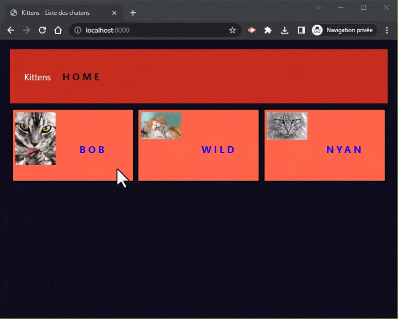

# Express.js

Express est un **framework minimaliste et flexible basé sur Node.js**.

Il permet de développer des applications web back-end, en simplifiant grandement la mise en place d'un serveur Node.js.

Nous avons vu précédemment comment définir un serveur Node.js de manière native avec le package `http`.
Express est une surcouche à ce package et offre des fonctionnalités très utiles pour gagner en temps et en productivité, notamment avec la notion de **routing** et de **méthodes**, mais aussi de **middlewares** qui  est fondamentale dans Express. 

Des bases en Node.js sont donc indispensables pour bien comprendre le fonctionnement d'une application Node.js avec Express.

**Documentation** : [https://expressjs.com/](https://expressjs.com/)

---

## Hello Express

Pour commencer, reprenons la base du projet précédent `/01_hello_modules/` pour créer un nouveau projet `/02_hello_express/` (vous pouvez copier/coller le dossier).

Nous allons aussi renommer `index.js` en `server.js` pour obtenir au final l'arborescence suivante :

```
/02_hello_express/
├── utils/
│   └── hello.js
├── server.js
├── package.json
└── package-lock.json
```

> N'oubliez pas de changer **index.js** par **server.js** dans `package.json`

### Initialiser un serveur

Express va nous permettre d'initialiser un serveur Node très simplement.

Pour installer Express dans un projet Node, on commence par récupérer le package depuis le registre NPM :

```bash
npm install express
```

L'écriture d'un serveur Web avec Express est beaucoup plus simple qu'en natif. Dans le fichier `index.js`, ajoutons le nécessaire pour créer ce serveur :

```js
// ℹ RAPPEL : Nous utilisons maintenant les ES Modules
import express from "express";
import { hello } from "./utils/hello.js";

// Création d'une "application" Express
const app = express();
const port = 8000;

// Déclaration de la "route" principale "/" (racine du serveur Web)
app.get("/", (req, res) => {
  // Envoi une réponse au client
  res.send(hello("World"));
});

// Démarrage du serveur "Express"
app.listen(port, () => {
  console.log(`Express server listening on http://localhost:${port}`);
});

```

### Répondre avec `.send`

La méthode `.send` de l'objet `Response` d'Express déclanche l'envoi d'une réponse HTTP au client.

(Annexe : [Documentation de res.send](https://expressjs.com/en/4x/api.html#res.send))

La première chose à noter est qu'Express est capable de "deviner" le type de la donnée à envoyer au client, et de définir automatiquement les bonnes en-têtes HTTP.

Par exemple :

```js
res.send("Hello World!");               // Envoi la réponse avec le header "Content-Type: text/html" (par défaut pour du texte)
res.send({ message : "Hello World!" }); // Envoi la réponse avec le header "Content-Type: application/json"
res.sendFile("./image.jpg");            // Envoi la réponse avec le header "Content-Type: image/jpeg"
```

Il est aussi possible de définir manuellement les status codes HTTP comme ceci :

```js
res.status(404).send("Not Found");
res.status(403).send("Forbidden");
res.status(500).send("Internal server error");
res.status(418).send("I'm a teapot 🍵");
```

(Annexe : [Liste des codes HTTP](https://fr.wikipedia.org/wiki/Liste_des_codes_HTTP))

### Récupérer et envoyer des Headers HTTP

Il est aussi possible d'accéder aux headers HTTP de la requête client :

```js
req.header('User-Agent');
req.headers;
```

… et de renvoyer des headers HTTP de réponse :

```js
res.set('Content-Type', 'text/plain');
res.set('Location', '/archive');
…
```

## Les routes

Les routes Express sont un moyen de traiter les requêtes client en fonction de l'URL demandée :

```js
// Route 1 : Traitement de l'URL /home
app.get('/home', (req, res) => {
  …
});

// Route 2 : Traitement de l'URL /contact
app.get('/contact', (req, res) => {
  …
});
```

Elles permettent de mieux séparer la logique de traitement de chaque chemin demandé par un client en évitant de faire une condition par requête.

### Méthodes GET et POST

Express est capable de différencier la **méthode HTTP** (aussi appelé le **verbe**) utilisé par le client pour accéder à une ressource.

Par exemple, lorsqu'un client clique sur un lien :

```html
<a href="/homepage">Accueil</a>
```

…, le navigateur Web va construire la requête HTTP suivante :

```http
GET /homepage HTTP/1.1
```

Express va donc être en capacité de comprendre que la méthode est `GET`, et la route `/homepage`.

C'est donc la déclaration suivante qui sera appelée par Express :

```js
app.get('/homepage', (req, res) => {
  res.send("Bienvenue sur l'accueil");
});
```

Le client recevra ensuite sa réponse HTTP avec le contenu « _Bienvenue sur l'accueil_ »

Maintenant, si un client valide le formulaire suivant :

```html
<form action="/send" method="POST">
  <button type="submit">Envoyer</button>
</form>
```

…, le navigateur Web va alors construire la requête HTTP suivante :

```http
POST /send HTTP/1.1
```

C'est maintenant la déclaration suivante qui sera appelée par Express :

```js
app.post('/send', (req, res) => {
  res.send("Formulaire correctement envoyé");
});
```

Le serveur réceptionne la requête POST, et renvoie un message de confirmation au client <small>(nous verrons plus loin dans le cours comment récupérer les données transmises avec le formulaire)</small>.

Express permet aussi de réagir aux autres méthodes HTTP telles que :

- PUT : `app.put( … )`
- PATCH : `app.patch( … )`
- DELETE : `app.delete( … )`

(Annexe : [Liste des méthodes HTTP supportées par Express](https://expressjs.com/en/4x/api.html#routing-methods))

Il n'existe pas de façons côté client d'invoquer ces verbes en HTML natif, c'est pourquoi on passe généralement par JavaScript pour préciser le verbe en cas de besoin :

```js
// Dans un navigateur Web (CLIENT) :
fetch('/articles/remove/42', { method: 'DELETE' })
  .then(() => {
    console.log('Article #42 supprimé sur le serveur ');
  });
```

### Syntaxe des chemins de route

Les chemins de route (route paths) sont décrits comme suit :

```js
app.get('/users/create', …);
```

Mais il peuvent aussi être dynamiques :

```js
app.get('/words/gr+s', …); // String patterns
//       /words/gros
//       /words/gras
//       /words/griiiis
//       …

app.get(/.*fly$/, …); // Regular expressions (regex)
//      butterfly 
//      dragonfly
//      firefly
//      …
```

(Annexe : [Route paths documentation](https://expressjs.com/en/guide/routing.html#route-paths))

### Paramètres dynamiques

Les paramètres de route permettent de récupérer une valeur dans la fonction associée.

On les déclare avec le caractère `:` suivi du nom que l'on souhaite donner, et on les récupère ensuite dans l'objet **`req.params`** :

```js
app.get('/user/:id', (req, res) => {
  res.send(`Bonjour ${req.params.id} !`);
});

//  /user/42     --> Bonjour 42
//  /user/25     --> Bonjour 25
//  /user/david  --> Bonjour david
```

(Annexe : [Route parameters documentation](https://expressjs.com/en/guide/routing.html#route-parameters))

### Paramètres de requête

Les paramètres de requêtes sont ceux que l'on retrouve dans la chaîne de requête (ou _query string_) :

```
/home?user=david&age=42
```

On les récupère dans l'objet **`req.query`** :

```js
app.get('/home', (req, res) => {
  res.send(`Bonjour ${req.query.user} ! Tu as ${req.query.age} ans !`);
});
```

---

## Gérer les fichiers statiques

Un serveur web doit être capable de fournir l'accès aux ressources statiques d'un site web, à savoir :

- les fichiers d'images
- les fichiers de style CSS
- les fichiers webfonts
- les fichiers de script JS (client)
- … etc.

En effet, lorsqu'un client accède à l'URL suivante : `http://server.com/styles/app.css`, il s'attend à recevoir le contenu du fichier CSS se trouvant sur le serveur.

Côté Express, on pourrait déclarer la route suivante qui fonctionnerait parfaitement :

```js
app.get('/styles/app.css', (req, res) => {
  res.sendFile('./public/styles/app.css');
});
```
> <small>(En admettant qu'il existe un dossier `/public/` à la racine du serveur contenant le fichier CSS)</small>

**QUESTION : À votre avis, pourquoi cette méthode (même si elle fonctionne) n'est pas une solution idéale ?**

---

Avec Express, il existe un moyen **d'indiquer un dossier sur le serveur** qui sera parcouru **lors de chaque requête client**, pour vérifier si le chemin demandé correspond à l'un des fichiers du dossier en question.

Il faut utiliser la fonction `express.static()` qui est un middleware (que nous verrons plus tard) avec la méthode `.use()` comme ceci :

```js
app.use(express.static('public'));
```

Cette ligne va littéralement faire les choses suivantes **lors de chaque requête HTTP** :

1. Analyser l'URL demandée par le client
2. Vérifier si l'URL correspond à un chemin de fichier valide dans le dossier `/public/` du serveur
  a. Si le fichier existe, il est immédiatement renvoyé au client et la requête est terminée !
  b. Si le fichier n'existe pas, la requête "continue son chemin" jusqu'à la prochaine route (ou au prochain middleware)

Il est très important de bien comprendre ce concept pour pouvoir assimiler la notion de middleware plus tard. Voici donc un exemple plus complet :

Soit l'arborescence de projet suivante :

```
.
├── server.js
└── public/
    └── images/
        └── banner.jpg
``` 

… et le code suivant pour `server.js` :

```js
import express from "express";

const app = express();
const port = 8000;

app.use(express.static("public"));

app.get("/home", (req, res) => {
  res.send("Welcome home!");
});

app.listen(port, () => console.log(`App démarrée sur http://localhost:${port}`));
```

Si un client interroge le serveur avec l'URL suivante pour obtenir la bannière :

```
GET http://localhost:8000/images/banner.jpg
```

… alors le serveur se comporte comme suit :

```
        (requête HTTP)
              │
              │
              V
app.use(express.static("public"));  ────────>  (réponse client avec /public/images/banner.jpg)
```

Le middleware `express.static()` enregistré par `app.use(  )` analyse la requête HTTP et répond au client s'il y a correspondance.

Maintenant, si le client interroge à nouveau le serveur avec cette requête :

```
GET http://localhost:8000/home
```

Le comportement est différent :

```
        (requête HTTP)
              │
              │
              V
app.use(express.static("public"));    (chemin non trouvé: on "laisse passer")
              │
              │
              V
app.get("/home", (req, res) => {
  res.send("Welcome home!");  ────────>  (réponse client avec « Welcome home! »)
});
```

Le middleware `express.static()` ne trouvant aucune correspondance pour `/home` dans le dossier `/public/` du serveur, il "laisse passer" la requête pour le middleware ou la route suivante.

Nous reviendrons sur ce principe plus tard, et verrons notamment comment écrire nos propre fonctions de middleware.

---

Pour terminer, revenons un instant sur la ligne suivante :

```js
app.use(express.static("public"));
```

Il faut savoir qu'en règle générale, Node.js préfère (et parfois même impose) de travailler avec des chemins **absolus**.

Cela permet en général d'éviter toute erreur de chargement liée à l'exécution de Node à partir d'un mauvais emplacement, ou dans un environnement différent.

Avec les modules **CommonJS**, nous avions accès à la variable globale `__dirname`, qu'il suffisait de concaténer avec le chemin souhaité (à l'aide du core-module `path`) comme ceci pour obtenir un chemin absolu :

```js
// ⚠️ CommonJS uniquement : Ce code est non valide si on utilise les ES Modules !
const path = require("path");
…
const absolutePublicPath = path.join(__dirname, 'public');
app.use(express.static(absolutePublicPath)); 
```

Malheureusement, cette variable `__dirname` n'existe pas dans le contexte d'un **ES Module**, il faut donc passer par une autre méthode pour obtenir le chemin absolu :

```js
// ES Modules
import path from "path";

// On "fabrique" nous-même `__dirname` à partir du chemin fourni par `import.meta.url` …
import { fileURLToPath } from "url";
const __dirname = path.dirname(fileURLToPath(import.meta.url));
…
const absolutePublicPath = path.join(__dirname, 'public');
app.use(express.static(absolutePublicPath));
```

**Exemple final de `server.js` :**

```js
import express from "express";
import path from "path";
import { fileURLToPath } from "url";

const app = express();
const __dirname = path.dirname(fileURLToPath(import.meta.url));
const port = 8000;

app.use(express.static(path.join(__dirname, 'public')));

app.get("/home", (req, res) => {
  res.send("Welcome home!");
});

app.listen(port, () => console.log(`App démarrée sur http://localhost:${port}`));
```

## 02 Exercice :  Hello Express

Prenez un instant pour tester l'ensemble des fonctionnalités vues dans votre projet `02_hello_express` :

- Ajoutez une route d'accueil affichant un titre HTML et une image de votre choix
- Ajoutez une route utilisant un **paramètre dynamique** et affichez-les en HTML
- Ajoutez une route utilisant des **paramètres de requête** (query string) et affichez-les en HTML
- Ajoutez une route pour gérer les erreurs 404 et renvoyez une réponse avec le status HTTP 404

> Note : Pour envoyer du HTML, nous allons pour l'instant le faire manuellement :
> ```js
> res.send(`
>   <h1>Hello ${fistname}</h1>
>   <p>Bienvenue sur ma page Express</p>
> `);
> ```
> Nous utiliserons plus tard un **moteur de templating** pour plus de flexibilité.

---

## 03 Exercice : Kittens

Vous allez construire une application web simple permettant de lister des photos de chatons.

Créez un nouveau projet d'exercice `03_kittens`, qui reprend la base de l'exercice précédent (supprimez juste toutes les routes).

Les données des base vous sont fournies dans le dossier d'exercices :

```
03_kittens/
├── data/
│   ├── kittens.json
│   ├── 1.json
│   ├── 2.json
│   └── 3.json
└── images/
    ├── bob.jpg
    ├── wild.jpg
    └── nyan.jpg
```

1. Créez une page d'accueil et affichez dans une liste ul/li l'ensemble des noms des chats ainsi que leurs photos respectives

2. Chaque nom de chat est cliquable. Sur la seconde page, vous afficherez en plus de leurs noms leurs ages et description.

3. Ajoutez du style CSS à votre projet.

Exemple :



