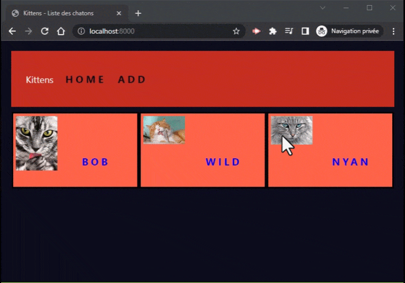

# Récupérer les données POST

Jusqu'à présent, nous avons principalement vu comment répondre à un client en renvoyant des données sous forme de contenu HTML.

Mais un client peut aussi envoyer des données vers un serveur, à l'aide d'un formulaire via la méthode HTTP POST :

```html
<form action="/users" method="POST">
  <input type="text" name="firstname" />
  <input type="text" name="lastname" />
  <input type="email" name="email" />

  <button type="submit">Envoyer</button>
</form>
```

Lors de la soumission du formulaire, le navigateur du client va construire la requête HTTP suivante :

```http
POST /users HTTP/1.1
Content-Type: application/x-www-form-urlencoded

firstname=John&lastname=Doe&email=john.doe@example.com
```

Les données d'un formulaire HTML envoyé avec la méthode POST sont envoyées par défaut avec le header `application/x-www-form-urlencoded`, et les données brutes du formulaire se trouvent dans le corps de la requête.

Côté Node.js avec Express, il faut maintenant récupérer les données en les parsant :

## express.urlencoded()

La fonction `express.urlencoded()` fournie par Express est un middleware dont le rôle est de :
1. parser les données de la requête POST
2. construire un objet `req.body` contenant ces données

On l'utilise comme suit :

```js
//                |
//                |
//                V
app.use(express.urlencoded({ extended: false })); // (extrait les données et construit `req.body`)
//                |
//                |
//                V

app.post('/users',  (req, res) => {
  req.body.firstname; // John
  req.body.lastname; // Doe
  req.body.email; // john.doe@example.com

  // …
});
```

> Le paramètre `{ extended: false }` permet de déterminer le parser d'URL utilisé en interne du middleware. Généralement, l'option `false` est suffisante. Référez-vous à la documentation de la méthode pour plus de détails.

(Annexe : [Documentation "express.urlencoded"](https://expressjs.com/en/4x/api.html#express.urlencoded))

## express.json()

La fonction `express.json()` elle-aussi fournie par Express, fonctionne de la même façon mais s'occupe de parser les données envoyées avec l'en-tête HTTP `application/json`.

C'est ce qui est plus souvent utilisé lorsqu'on échange avec le client en mode API : le client envoie des données par le biais d'un `fetch()` et passe des données au format JSON :

```js
// Dans un navigateur Web (CLIENT) :
const dataToSend = {
  firstname: "John",
  lastname: "Doe",
  email: "john.doe@example.com",
};

fetch("/users", {
  method: "POST",
  headers: { "Content-Type": "application/json" },
  body: JSON.stringify(dataToSend),
}).then(() => {
  console.log("User created on server");
});
```

L'en-tête HTTP de format est différente, il faut donc adapter côté Express la fonction de middleware en charge de l'extraction des données, mais le principe reste le même :

```js
//           |
//           |
//           V
app.use(express.json()); // (extrait les données AU FORMAT JSON et construit `req.body`)
//           |
//           |
//           V

app.post('/users',  (req, res) => {
  req.body.firstname; // John
  req.body.lastname; // Doe
  req.body.email; // john.doe@example.com

  // …
});
```

## 05 Exercice : Kittens post

Reprenez le projet **04 Kittens controller** et ajoutez la fonctionnalité permettant d'ajouter un nouveau chaton dans la liste.

Vous déclarerez 2 nouvelles routes (et leur contrôleur associé) dans le routeur "kittens" :

- `/add` pour afficher le formulaire
- `/add` pour récupérer les données du formulaire

Vous devrez lors de l'ajout d'un chaton créer le fichier `<id>.json` et mettre à jour le fichier `kittens.json`. Utilisez le module `fs` de Node.js pour cela)

**📢 Point important !**

Sachant que nous n'avons pas encore vu comment uploader des images avec Express, vous utiliserez un simple champs texte pour les photos de chats, et le service "https://placekitten.com/" dans votre formulaire d'ajout.

Vous pourrez ensuite adapter l'affichage avec une simple condition, par exemple :

```js
  const kittenImage = kitten.image.startsWith("http")
    ? kitten.image
    : `/images/${kitten.image}`;
    
  res.send(`
    …
    
    …
  `);
```

