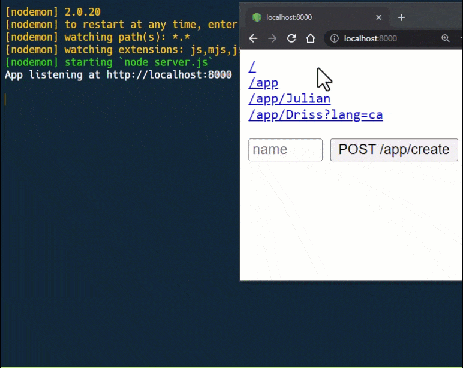

# Les Middlewares Express

La notion de middleware est un concept fondamental d'Express, et est basée exclusivement sur <u>les fonctions</u> : En effet, une application Express n'est ni plus ni moins qu'une **succession d'appels de fonctions middleware**.

Nous avons déjà abordé certaines d'entre elles dans ce cours :

- `express.static()`
- `express.urlencoded()`
- `express.json()`

Ces fonctions middleware sont proposées nativement par Express et permettent d'effectuer diverses actions lors d'une requête.

Elles peuvent notamment :
- analyser la requête et décider de déclancher l'envoi d'une réponse au client (`express.static`)
- analyser les données et le type d'une requête et ajouter des propriétés à l'objet de requête (`express.urlencoded`/`express.json`)

```js
//      (requête HTTP)
//            |
//            |
//            V
app.use( express.static(…) );
//            |
//            |
//            V
app.use( express.urlencoded(…) );
//            |
//            |
//            V
app.use( express.json() );
//            |
//            |
//            V
app.get('/', (req, res) => {
  …
});
```

Il existe d'autres packages NPM proposant des middlewares, et il est aussi bien sûr possible de créer les notres.

Un middleware est en effet *une simple fonction JavaScript* qui accepte **3 arguments** : `req`, `res` et `next` et va généralement se résumer aux actions suivantes :

- Exécuter tout type de code.
- Apporter éventuellement des modifications aux objets de requête et de réponse `req` et `res`.
- Court-circuiter éventuellement le cycle de demande-réponse.
- Appeler le middleware suivant dans la pile avec la fonction `next()`.

Voici un exemple de fonction middleware produisant un simple log avant de passer à la suite :

```js
function myMiddleware(req, res, next) {
  console.log('Hi there!');
  next();
}
```
```js
//      (requête HTTP)
//            |
//            |
//            V
app.use( myMiddleware ); // « Hi there! » --> next()
//            |
//            |
//            V
app.get('/', (req, res) => {
  …
});
```

**⚠️ Attention !**
Veuillez noter que l'on N'EXÉCUTE PAS la fonction `myMiddleware` avec les parenthèses : on ne fait que la fournir à `.use()` qui se chargera de l'appel lorsqu'une requête HTTP se produira.
```js
app.use( myMiddleware() ); // ❌ Ceci NE FONCTIONNERA PAS !
```

En revanche, si vous souhaitez pouvoir paramétrer votre middleware, il faudra le déclarer comme suit :

```js
function myMiddleware(message) {
  return function (req, res, next) {
    console.log(message);
    next();
  }
}
```

Ce pattern appelé le [currying (ou curryfication en Français)](https://fr.javascript.info/currying-partials) permet ici de renvoyer une fonction de middleware pré-paramétrée avec le message de log.

Désormais, on peut utiliser notre middleware comme précédemment :
```js
app.use( myMiddleware('Hello') ); // ✔️ Ceci est maintenant valide car l'appel à "myMiddleware" renvoie une fonction
```


# Niveau application / Niveau routeur

Un middleware peut s'enregistrer de 2 façons dans Express. Nous avons déjà vu l'enregistrement au **niveau application** en liant le middleware à une instance de l'objet `app` avec `app.use( middleware )`.

Le middleware **niveau routeur** fonctionne de la même manière, à l'exception près qu'il est directement lié à une instance de route. Exemple :

```js
function myMiddleware(message) {
  return function (req, res, next) {
    console.log(message);
    next();
  }
}

// Enregistrement de `myMiddleware` au niveau routeur
app.get('/home', myMiddleware('Checking /home'), (req, res) => {
  …
});
```

Le nombre de middleware est illimité :

```js
app.get("/home",
  myMiddleware("one"),
  myMiddleware("two"),
  myMiddleware("tree"),
  (req, res) => {
    …
  }
);
```

Ce type d'enregistrement peut être pratique pour par exemple choisir de protéger l'accès à des routes précises :

```js
app.get('/home', …);
app.get('/dashboard', isLogged, …)
app.get('/admin', isLogged, isAdmin, …);
```

## 01 Exercice : Logger

Vous allez partir du squelette d'application `/simple_00/` (faites une copie du dossier et renommez-le en `/01_logger/`).

Vous devez dans cet exercice créer 2 fonctions middleware :

- Une fonction pour incrémenter un compteur de requête, et stocker ce compteur dans l'objet de requête pour le middleware suivant
- Une fonction affichant un message de log dans la console pour chaque requête sous la forme suivante :
```
<COUNTER>) <METHOD> <PATH> <QUERY|BODY>
```

Démonstration du résultat attendu :



Créez un fichier `./middlewares.js` à la racine qui exportera vos 2 fonctions. Les fonctions devront être importées et utilisées comme middlewares dans `server.js`

Veillez à placer les middlewares dans le bon ordre pour que l'affichage fonctionne correctement.

> Pour tester votre logger, vous pouvez utiliser une route Express « globale » :
> ```js
> app.all("*", (req, res) => {
>   res.send(`
>     <code>
>       <a href="/">/</a><br>
>       …
>     </code>
>   `);
> });
> ```

---

# Annexes

- [Using middlewares](https://expressjs.com/en/guide/using-middleware.html)
- [Writing Middlewares](https://expressjs.com/en/guide/writing-middleware.html)
- [Le middleware MORGAN pour afficher des logs](https://stacklima.com/qu-est-ce-que-morgan-dans-node-js/)