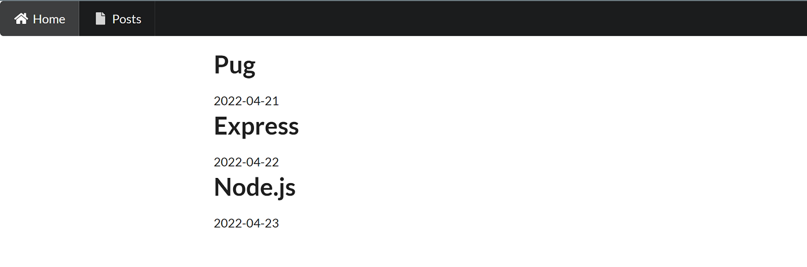

# Templating 

Nous allons utiliser Pug avec Express pour gérer dynamiquement les pages HTML.

Brancher un moteur de templating sur Express est extrêmement simple.

Nous organiserons dans un premier temps les templates de vues avec l'arborescence suivante :

```text
views/
    layouts/
        frontend.pug
    blog/
        index.pug
        contact.pug
```

Exemple de fichier `index.pug` :

```pug
extends layouts/frontend.pug

block content
    h1 Titre
    p My page
```

… et un exemple de fichier dans `layout/frontend.pug` qui irait avec :

```pug
doctype html
html(lang="en")
    head
        meta(charset="UTF-8")
        title Document
    body
        block content

        footer
            © Tous droits réservés
```

Rappel : La syntaxe est simple pour que le moteur interprète et affiche les variables dans les vues, nous avons un système d'interpolation :

```pug
//- Pour écrire le contenu d'une expression
#{expression}

div= expression //- Syntaxe simplifiée pour une expression se trouvant dans une balise unique

//- Commentaire Pug (non affiché chez le client)
// Commentaire HTML (affiché chez le client)
```

Pour faire une boucle on utilisera naturellement l'opérateur `each` :

```pug
each post in posts
    div
        h1= post.title
        p= post.date
```

## Installation & configuration

Dans votre projet de manière classique vous récupérez le module Pug :

```bash
npm install pug
```

Dans le point d'entrée de votre application (server.js) vous devez importer Pug comme suit :

```js
import express from 'express';
const app = express();

app.set('view engine', 'pug'); // Indique à Express le nom du package du moteur de template

/*
    Par défaut, Express ira chercher les vue dans un dossier ./views/
    Si vous souhaitiez éventuellement placer les vues ailleurs,
    il faudrait le préciser avec la ligne suivante :

app.set('views', './path/to/views'); // Indique à Express le dossier dans lequel se trouverons les vues .pug

*/
```

Une fois Pug intégré dans le projet vous pouvez maintenant utiliser le moteur de rendu avec la méthode render sur la méthode res (response) dans Express :
 
```js
app.get('/home', (req, res) =>{
    
    // Ira automatiquement chercher "./views/home.pug"
    res.render('home', {
        posts : posts,
        users : users
    });

});
```

**Notez que pour faire passer des données vous utiliserez une syntaxe JSON clé/valeur.**

Dans la vue de manière dynamique, vous pourrez afficher les données :

```pug
extends layouts/frontend.pug

block content
    h1 Posts
    ul#posts
        each post in posts
            li #{post.title} (#{post.date})
```

## 01 Exercice posts Pug

En partant du modèle **simple_00** et en utilisant **semantic ui** pour le côté graphique, affichez la liste des posts suivants. Vous utiliserez un template principal **index.pug** et un fichier de layout : `frontend.pug`

Organisez les templates comme dans le modèle proposé dans le cours. Pensez à utiliser la documentation officielle Pug : https://pugjs.org/

```js
const posts = [
  { title : "Pug", date : "2022-04-21"},
  { title : "Express", date : "2022-04-22"},
  { title : "Node.js", date : "2022-04-23"},
];
```

- Wireframe :



