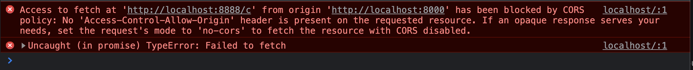

# Cors

Nous allons expliciter la problématique CORS.



## 01 Example mise en oeuvre du problème

Récupérez l'exemple dans le dossier Examples du support de cours. Puis installez les dépendances.

A la racine du projet :

```bash
npm install
```

Problématique : dans le code HTML côté client, on fait une requête **fetch** sur **une autre adresse** que le serveur qui a envoyé la page. Dans ce cas les navigateurs modernes bloquent la requête la considérant comme non sécurisée : CORS (Cross Origin Resource Sharing).

Le server.js envoi la page depuis l'adresse http://localhost:8000

```js
// ...
app.get("/", (req, res) => {
  const home = fs.readFileSync(__dirname + "/views/home.html", "utf-8");
  res.send(home);
});
```

Le client fait de son côté une requête vers une autre adresse http://localhost:8888/c

```html
<script>
    fetch("http://localhost:8888/c")
        .then(response => response.json())
        .then( ({users}) => {
            let u = "<ul>";
            for (const user of users) u += `<li> ${user.name}  </li>`;
            const container = document.querySelector('.c');
            container.innerHTML = u;
        });

</script>
```

Finalement la requête fetch est bloquée par le navigateur. Sachez cependant, qu'il y a du Cross Origin resource sharing pour les images, css et scripts. Ces fichiers ne sont pas bloqués par défaut par le navigateur.

Pour lever le bloquage de notre requête on définit des entêtes spécifiques depuis le serveur api.js. Pour indiquer au client qu'il peut recevoir les données.

Vous pouvez utiliser le module : **cors**, que vous devez installer au préablable dans votre application.

```bash
npm install cors
```

Puis modifiez votre API comme suit :

```js
import express from "express";
import dotenv from "dotenv";
import cors from 'cors';

dotenv.config();
const { APP_LOCALHOST_B: hostname, APP_PORT_B: port } = process.env;
const app = express();

app.use(cors());

app.get("/c", (req, res) => {
  const users = [
    { name: "Leanne Graham b" },
    { name: "Ervin Howell b" },
    { name: "Clementine Bauch b" },
    { name: "Patricia Lebsack b" },
  ];
  res.json({ users });
});

app.listen(port, () => {
  console.log(`Example app listening at http://${hostname}:${port}`);
});
```